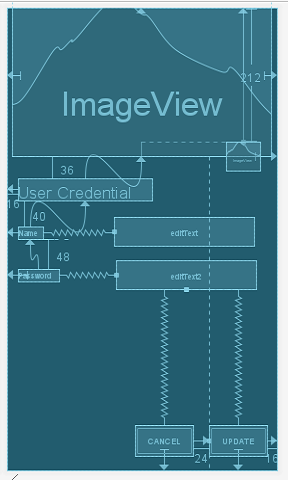

<b>ConstraintLayout Design sample</b>

This is the sample app that shows how to implement ConstraintLayout in Android

The steps that required to use ConstraintLayout:

<b>Include in your project</b>

Android Studio 2.2 and above

<b> Gradle dependencies </b>

ConstraintLayout library in <b>build.gradle</b> file with latest version:

<pre>dependencies 
{
  compile 'com.android.support.constraint:constraint-layout:x.x.x'
}</pre>

# output :
 

